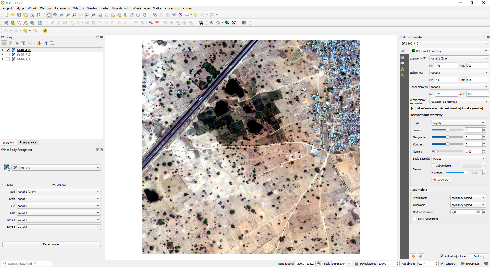
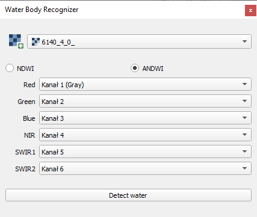
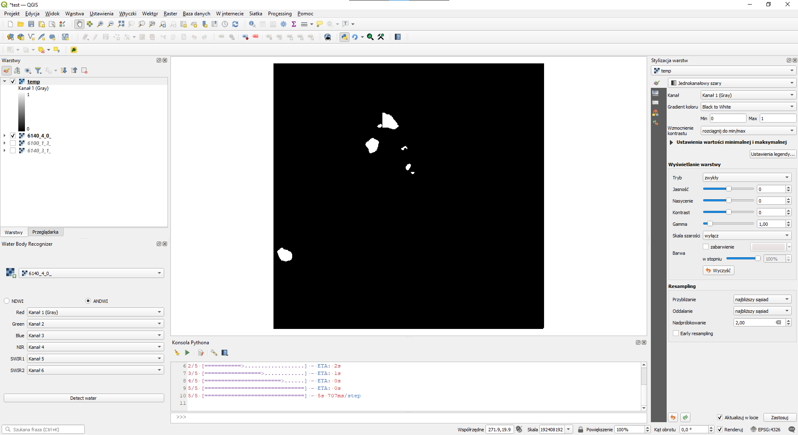

# Water Body Recognizer 
### Requirements
1. Installed at least QGIS 3.16 with h5py.</li>
2. Installed all requirements from requirements.txt in QGIS Python.</li>
3. Installed tensorflow or tensorflow-gpu 2.5.0 in QGIS Python. 
    `pip install tensorflow==2.5.0 or pip install tensorflow-gpu==2.5.0`
### Installation
1. Pull code to the _(QGIS directory)\apps\qgis\python\plugins_.
2. Run QGIS app.
3. If plugin is not visible turn it on in Plugins Manager (Plugins > Manage and Install Plugins...)
### Usage
1. Add raster layer (e.g. _img/example_image.tiff_). 

2. Choose band and algorithm. 

3. Detect water. 

###Notes: 
1. Before segmentation can be performed, the learned models for both the [NDWI](https://politechnikawroclawska-my.sharepoint.com/:u:/g/personal/238025_student_pwr_edu_pl/ESV04L1oxCtDonqiJde9KxMBG7FrhPhOsO0V9u-aDtw0HQ) and [ANDWI](https://politechnikawroclawska-my.sharepoint.com/:u:/g/personal/238025_student_pwr_edu_pl/EQH8bYWPgaFEvjp2fJ34miwBRVyA8frQEyXITv6VqSKmvg?e=GJPOB2) indexes must be downloaded to the plugin folder
2. Sometimes before detecting water opened QGIS Python Console is required.
